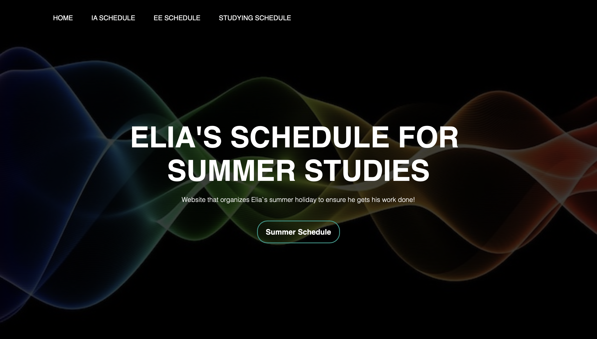
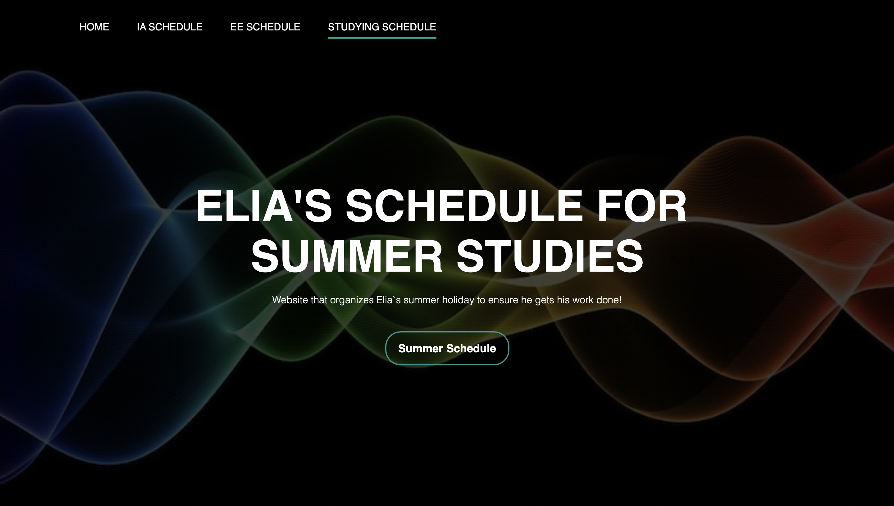
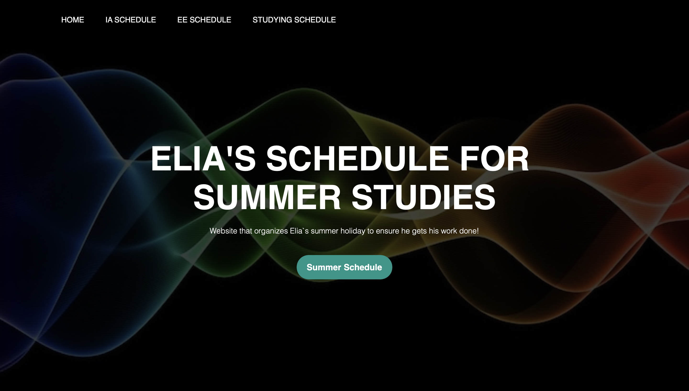

### HTML file for the cover page. I personalized it to be the cover page for a website that organizes my summer schedule for studies
```.html
<!DOCTYPE html>
<html lang = "en">
<head>
    <title>Cover Page</title>
    # Connection between html and css file
    <link rel = "stylesheet" href = "quiz54(maybe).css">
</head>

<body>
    <div class="banner">
        #navigator for menu
        <div class="navbar">
            <ul>
                #menu headings
                <li><a href="#">Home</a></li>
                <li><a href="#">IA Schedule</a></li>
                <li><a href="#">EE Schedule</a></li>
                <li><a href="#">Studying Schedule</a></li>
            </ul>
        </div>

        <div class="content">
            #title that will appear in the center of my cover page
            <h1>ELIA'S SCHEDULE FOR <br> SUMMER STUDIES</h1>
            #subtitle below my title
            <p> Website that organizes Elia`s summer holiday to ensure he gets his work done! </p>

        <div>
            #Button
            <button type="button"> <span></span>Summer Schedule </button>
        </div>

        </div>

    </div>

</body>
</html>
```
### The following is the CSS file that organizes the layout of the website.
```.csss
*{
    margin: 0;
    padding: 0;
font-family: sans-serif;
}
    .banner{
        #Background for the webpage
        width: 100%;
        height: 100vh;
        background-image: linear-gradient(rgba(0,0,0,0.75), rgba(0,0,0,0.75)), url(background-pic.jpg);
        background-size: cover;
        background-position: center
    }
    .navbar{
        #Layout of the menu
        width:85%;
        margin: auto;
        padding: 35px 0;
        display: flex;
        align-items: center;
        justify-content: space-between;
    }
    .navbar ul li{
        #distance between menu item and the line that appears when hovering over it
        list-style: none;
        display:inline-block;
        margin: 0 20px;
        position: relative;
    }
    .navbar ul li a{
        #Color of theline that appears when hovering over the menu
        text-decoration: none;
        color: #fff;
        text-transform: uppercase
    }
    .navbar ul li::after{
        #What happens after cursor stops hovering over a menu item
        content:'';
        height: 3px;
        width: 0;
        background: #009688;
        position: absolute;
        left: 0;
        bottom:-10px;
        transition: 0.5s;
    }
    .navbar ul li:hover::after{
        #The length of the line when hovering over the menu
        width: 100%;

    }
    .content{
        #Layout of the title and subtitle of the webpage
        width: 100%;
        position: absolute;
        top: 50%;
        transform: translateY(-50%);
        text-align: center;
        color: #fff;
    }
    .content h1{
        #font-size of the title
        font-size: 70px;
        margin-top: 80px;
    }
    .content p{
        #size of the subtitle
        margin: 20px auto;
        font-weight: 100;
        line-height: 20px;
    }
    button{
        #Layout, size, border, and color of the button
        width: 200px;
        padding:15px 0;
        text-align: center;
        margin: 20px 10px;
        border-radius: 25px;
        font-weight: bold;
        border: 2px solid #009688;
        background: transparent;
        color: #fff;
        cursor: pointer;
        font-size: 18px;
        position: relative;
        overflow: hidden;
    }
    span{
        # The change in color when the cursor hovers on the button
        background: #009688;
        height: 100%;
        width: 0;
        border-radius:25px;
        position: absolute;
        left: 0;
        bottom: 0;
        z-index: -1;
        transition: 0.5s;
    }
    button:hover span{
        #The width of the color when cursor hovers on the button
        width: 100%;
    }
    button:hover{
        # Border of the button when cursor hovers on the button
        border: none;
    }
``` 


Fig 1. The picture of the cover page


Fig 2. What the menu item looks like when the cursor hovers over it


Fig 3. What the button item looks like when the cursor hovers over it

### Resource used when creating the cover page

https://www.youtube.com/watch?v=PgAZ8KzfhO8
