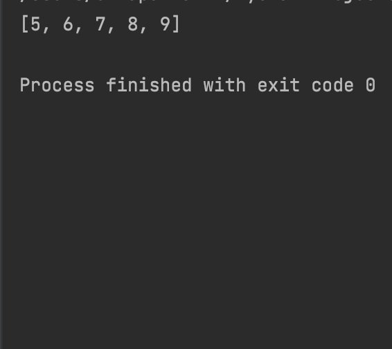

```.py
'''code to sort numbers in ascending order'''
num = [9,8,7,6,5]
for i in range(len(num)):
    for n in range(i+1, len(num)):
        if num[i]>num[n]:
            num[i], num[n] = num[n], num[i]

print(num)
```


