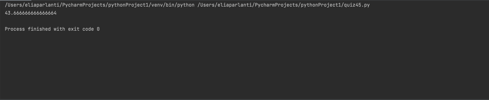

```.py
class students:
    def __init__(self,list):
        self.list = list
    #method to get the average
    def get_average(self):
        total = 0
        for item in self.list:
            total += item["score"]
        return total/len(self.list)

student = students([{"name":"bob","score":40},
                    {"name":"alice","score":56},
                    {"name":"bob","score":35}])
print(student.get_average())
```

