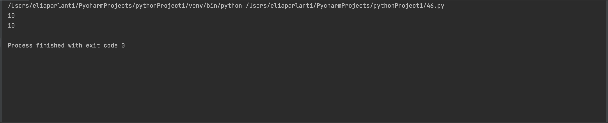

```.py
# A narcissistic number is a number that equals the sum of its own digits each raised to the power of the number of digits.
def narcissistic(num1, num2):
    # To figure out the range to put inside the for loop
    if num1 >= num2:
        greater = num1
        less = num2
    if num2 > num1:
        greater = num2
        less = num1
    # Narcissistic numbers
    NNumbers = [0, 1, 2, 3, 4, 5, 6, 7, 8, 9, 153, 370, 371]
    answer = 0
    for numbers in range(less, greater+1, 1):
        # To get each number inside the "NNumbers" list
        for i in range(len(NNumbers)):
            if numbers == NNumbers[i]:
                answer += 1
    return answer

print(narcissistic(1,154))
print(narcissistic(2,370))
```

