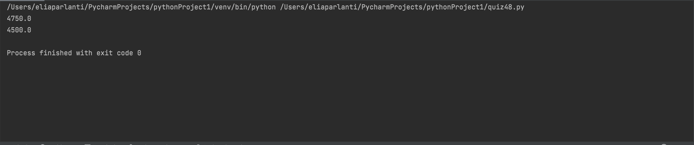

```.py
# Create a function that given the profile of the land in a list of x,y points, it returns the middle of the only flat section (xm, ym)
def MarsLander(coordinates: list):
    for i in range(len(coordinates)):
        #To get the number inside a paranthesis in a list, you can index an index.
        if coordinates[i][1] == coordinates[i-1][1]:
            y_coordinate1 = coordinates[i]
            y_coordinate2 = coordinates[i-1]

    x_coordinates = y_coordinate1[0] + y_coordinate2[0]
    answer = x_coordinates / 2
    return answer

print(MarsLander([(0, 100), (1000, 500), (1500, 1500), (3000, 1000), (4000, 150), (5500, 150), (6999, 800)]))
print(MarsLander([(0, 1000), (300, 1500), (350, 1400), (500, 2000), (800, 1800), (1000, 2500), (1200, 2100), (1500, 2400), (2000, 1000), (2200, 500), (2500, 100), (2900, 800), (3000, 500), (3200, 1000), (3500, 2000), (3800, 800), (4000, 200), (5000, 200), (5500, 1500), (6999, 2800)]
))
```

